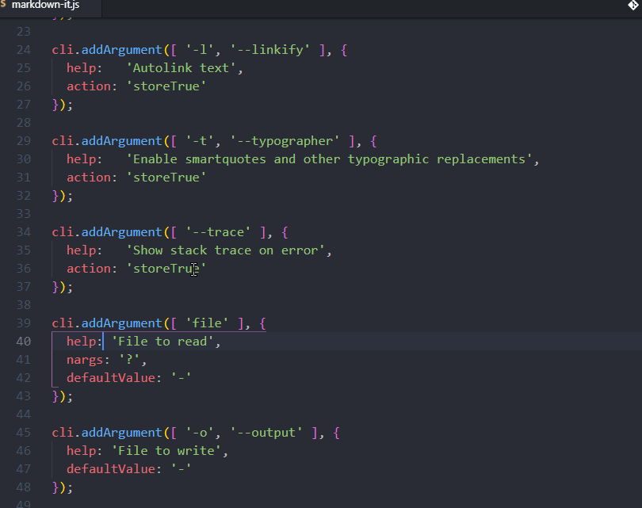

# Select Lines

Select multiple lines.

Adds a `Select Lines` command that prompts for a number of lines to select. It reads the next keybord input, and doesn't use an input box, meaning a max of 9 lines. Use `-` as input, and then type a number to select upward lines.

